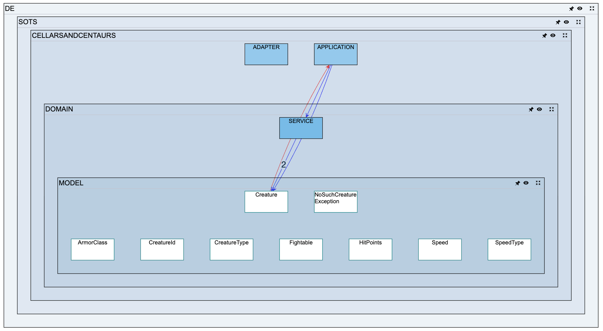

<div align="center">
  <!-- Logo -->
  <!-- TODO: Add DependaCharta logo here -->
  <!-- <a href="https://github.com/MaibornWolff/DependaCharta">
    
  </a> -->

  <h1>DependaCharta</h1>

  <!-- Links -->
  <p>
    <a href="https://maibornwolff.github.io/DependaCharta/"><strong>🚀 Try Web Studio</strong></a> •
    <a href="#what-is-dependacharta">About</a> •
    <a href="#features">Features</a> •
    <a href="#getting-started">Getting Started</a> •
    <a href="#get-involved">Get Involved</a> •
    <a href="#links">Links</a>
  </p>

  <!-- Analysis -->
  <div>
    <a href="https://github.com/MaibornWolff/DependaCharta/actions/workflows/build-analysis.yml">
      </a>
    <a href="https://sonarcloud.io/dashboard?id=maibornwolff-gmbh_DependaCharta_analysis">
      </a>
    <a href="https://sonarcloud.io/project/activity?id=maibornwolff-gmbh_DependaCharta_analysis&graph=coverage">
      </a>
  </div>

  <!-- Visualization -->
  <div>
    <a href="https://github.com/MaibornWolff/DependaCharta/actions/workflows/build-visualization.yml">
      </a>
    <a href="https://sonarcloud.io/dashboard?id=maibornwolff-gmbh_DependaCharta_visualization">
      </a>
    <a href="https://sonarcloud.io/project/activity?id=maibornwolff-gmbh_DependaCharta_visualization&graph=coverage">
      </a>
  </div>

</div>

---

<div align="center">

### 🌐 Try the Web Studio Now!

**No installation required • Instant visualization • Works in your browser**

Analyze and visualize your codebase dependencies directly in your browser.
Upload your `.cg.json` file or explore with sample data.

<p>
  <a href="https://maibornwolff.github.io/DependaCharta/">
    
  </a>
</p>

*Fully client-side • Your data never leaves your machine • Privacy guaranteed*

</div>

---

<!-- TODO: Add screenshot here -->
<!--  -->

## What is DependaCharta

Having trouble understanding the structure and dependencies in your codebase? DependaCharta is a multi-language code analysis and visualization tool that helps you quickly identify disadvantageous dependencies, cyclic dependencies, and quality hotspots. It runs entirely locally, works with non-compilable code, and supports multiple programming languages. DependaCharta is an open source project developed by [MaibornWolff](https://www.maibornwolff.de/en).

### Your Data Stays Local

**All analysis and visualization happens entirely on your machine.** No data is ever uploaded, shared, or transmitted to any external service. Your code stays private and secure. DependaCharta has no analytics, tracking, or telemetry built-in.

## Features

### DependaCharta CLI (Analysis)

The Analysis component is a command-line tool that analyzes codebases using [Tree-sitter](https://tree-sitter.github.io/tree-sitter/) parsers. It creates `.cg.json` files containing structural information about your project, including:

- File and package hierarchies
- Dependencies between files and packages
- Cycle detection with detailed cycle information
- Levelization for architectural insights
- Support for multiple programming languages: **Java, C#, C++, TypeScript, PHP, Go, Python**

Don't see your language? You can [extend the supported languages](analysis/howto-add-new-language.md) by adding a new parser!

<!-- TODO: Add analysis overview screenshot -->
<!--  -->

### DependaCharta Web (Visualization)

The Visualization component is an Angular/TypeScript web application using [Cytoscape.js](https://js.cytoscape.org/) for interactive dependency graphs. Features include:

- Interactive graph visualization of your codebase structure
- Navigate through package and file dependencies
- Filter and highlight critical dependencies
- Identify cyclic dependencies and architecture violations
- Find quality hotspots requiring attention
- Multiple layout algorithms for optimal viewing
- Available as both web app and Electron desktop application

<!-- TODO: Add visualization overview screenshot -->
<!--  -->

## Getting Started

### Prerequisites

- **Analysis**: Java 11 or higher
- **Visualization**: Node.js 18 or higher
- **Optional**: [just](https://github.com/casey/just) for convenient commands

### Quick Start with Just

DependaCharta includes a `justfile` for streamlined workflows:

```bash
# Install just if you haven't already
brew install just  # macOS
# or: cargo install just
# or: npm install -g just-install

# Run unit tests
just test

# Build the analysis tool
just build

# Analyze a directory and view results (builds first if needed)
just analyze <directory-to-analyze>

# Start frontend development server only
just frontend
```

**Note**: The `analyze` command runs the analysis and automatically opens the visualization with your results!

### Manual Setup

#### Analysis Component (Kotlin)

```bash
cd analysis

# Build the analysis tool
./gradlew fatJar

# Run the analyzer
java -jar build/libs/dependacharta.jar -d <directory-to-analyze>
# Or use the convenience scripts:
# bin/dependacharta.sh (Mac/Linux)
# bin/dependacharta.bat (Windows)

# Run tests
./gradlew test
```

For detailed analysis documentation, see [analysis/README.md](analysis/README.md).

#### Visualization Component (Angular)

```bash
cd visualization

# Install dependencies
npm ci

# Development server (http://localhost:4200)
npm run start

# Run as Electron app
npm run start-electron

# Build for production
npm run build

# Run tests
npm run test

# Package for distribution
npm run package-win         # Windows
npm run package-mac-silicon # macOS ARM64
npm run package-mac-intel   # macOS x64
```

For detailed visualization documentation, see [visualization/README.md](visualization/README.md).

### Docker Support

```bash
# Build Docker image
just docker-build

# Run analysis with Docker
just docker-run <directory-to-analyze>

# Analyze and view results
just docker-analyze <directory-to-analyze>
```

## Get Involved

Do you have a **bug**, **feature request**, or question? Please open [a new issue](https://github.com/MaibornWolff/DependaCharta/issues/new).
Feedback is always welcome.

Want to **contribute**? Check out our [contributing guide](dev_docs/CONTRIBUTING.md) and [developer start guide](dev_docs/DEV_START_GUIDE.md).

## Development Practices

- Test-driven development with tests before implementation
- Clean Code principles (pragmatic, not dogmatic)
- [Semantic Versioning](https://semver.org) for releases
- Automated CI/CD pipeline (see [Pipeline.md](Pipeline.md))

## Links

- [Releases](https://github.com/MaibornWolff/DependaCharta/releases)
- [Analysis Documentation](analysis/README.md)
- [Visualization Documentation](visualization/README.md)
- [How to Add a New Language](analysis/howto-add-new-language.md)
- [Cycle Detection Algorithm](analysis/src/main/kotlin/de/maibornwolff/dependacharta/pipeline/processing/cycledetection/README.md)
- [Levelization Algorithm](analysis/src/main/kotlin/de/maibornwolff/dependacharta/pipeline/processing/levelization/README.md)
- [Architecture Decision Records](doc/architecture/decisions)
- [Pipeline Documentation](Pipeline.md)


## License

BSD-3-Clause License

---

Made with ❤ by [MaibornWolff](https://www.maibornwolff.de/en) &nbsp;&middot;&nbsp; GitHub [@MaibornWolff](https://github.com/maibornwolff)
