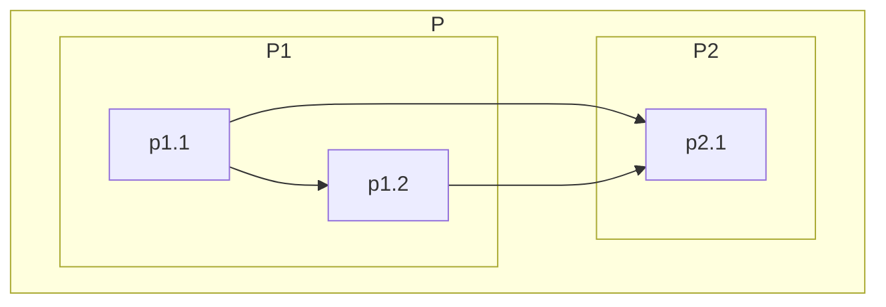
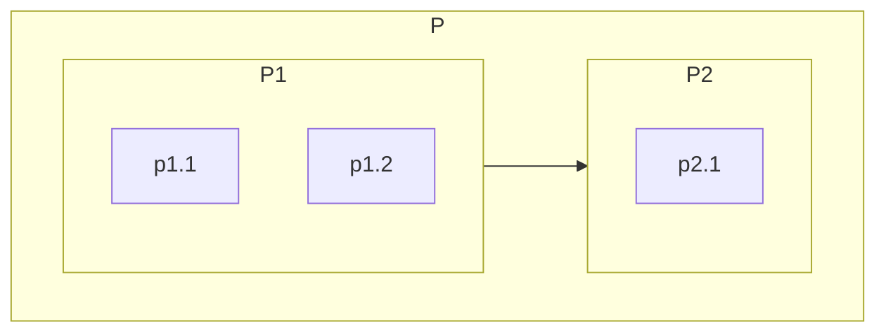
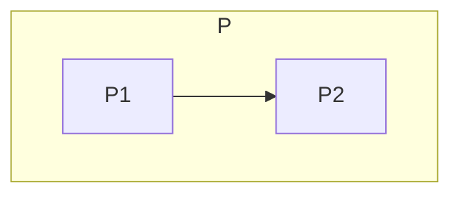

# Levelization Algorithm
Levelization of package P
1) Get all edges inside P
2) Simplify edges, so that they only connect direct children in P
3) Rank direct children
   1) Remove Cycles:
      1) Find first cycle
      2) Cut edge in that cycle which goes to the node with the least incoming edges
      3) Repeat until no more cycles can be found
   2) Determine level of children
      1) Get Children without Dependencies (bottom) => Level 0 nodes
      2) Find all nodes that only depend on Level 0 nodes => Level 1 nodes
      3) Find all nodes that on depend on Level 1 + 0 nodes => Level 2 nodes
      4) Repeat until all nodes are distributed
4) Levelize children folders

### Initial State:

### Simplified Edges After Step 2

### Levelized Direct Child Nodes After Step 3

### LSM After Step 4 (Levelization of P1 and P2)
